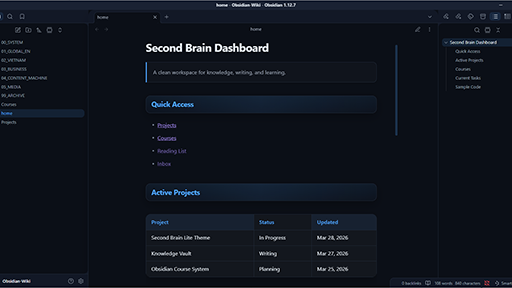

# Second Brain Lite

A clean Obsidian theme designed for knowledge systems, courses, and long-form thinking.

## Installation

1. Download the repository
2. Copy `manifest.json` and `theme.css` into:

.obsidian/themes/SecondBrainLite/

3. Open Obsidian → Appearance → Themes
4. Select “SecondBrain”

## Demo Dashboard

A sample dashboard is included in home.md

To use it:

1. Copy the files home.md
2. Paste them into your Obsidian vault
3. Open `home.md`
4. Switch to Reading View
